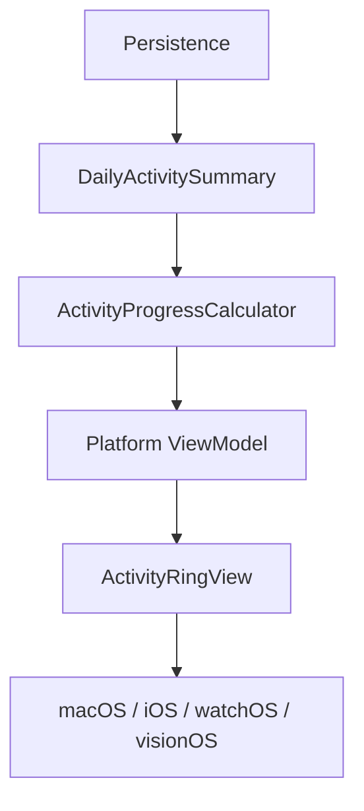

# Activity Ring Architecture

## Purpose

The TimeBite Daily Activity Ring is a shared domain concept, not a platform-specific widget.

It must support:

- macOS
- iOS
- watchOS
- visionOS

without splitting the calculation logic into separate implementations.

## Separation Of Concerns

### Data

Data describes the day:

- date
- planned work
- completed work
- completed actions
- focus time
- goal-linked progress
- AM reflection
- PM reflection

### Calculation

The domain layer converts raw activity into normalized values that can be safely rendered by any platform.

### Presentation

UI layers decide how the normalized values look:

- large dashboard ring on macOS
- today ring on iOS
- compact ring on watchOS
- spatial dashboard ring on visionOS

## Shared Domain Types

- `DailyActivitySummary`
- `ActivityRingProgress`
- `DailyReflectionSummary`
- `ActiveFocusSession`

## Calculator

`ActivityProgressCalculator` is the deterministic domain component that converts raw counts into normalized ring data.

It must:

- be pure
- be testable
- clamp display progress to `0.0 ... 1.0`
- preserve raw completion data for downstream use

Examples:

- `0 completed / 8 planned = 0`
- `4 completed / 8 planned = 0.5`
- `8 completed / 8 planned = 1`
- `10 completed / 8 planned = 1` for ring rendering, while keeping the raw ratio available

## Proposed Flow

## Platform Responsibilities

### macOS

Use the ring as a large primary dashboard component.

### iOS

Use the ring as the Today surface indicator.

### watchOS

Use the ring in compact form with minimal text.

### visionOS

Use the ring as part of a spatial dashboard composition.

## Implementation Rules

- Do not tie the domain model to SwiftUI, HealthKit, WatchKit, AppKit, UIKit, or RealityKit.
- Keep the calculator deterministic and side-effect free.
- Keep the SwiftUI ring view declarative and display-only.
- Allow platform view models to format labels and select layout variants.

## Reusable SwiftUI View

`ActivityRingView` accepts only normalized display data and presentation labels.

It should not know:

- how the progress was calculated
- where the data came from
- which platform is rendering it

That keeps the ring reusable across all four platforms.
